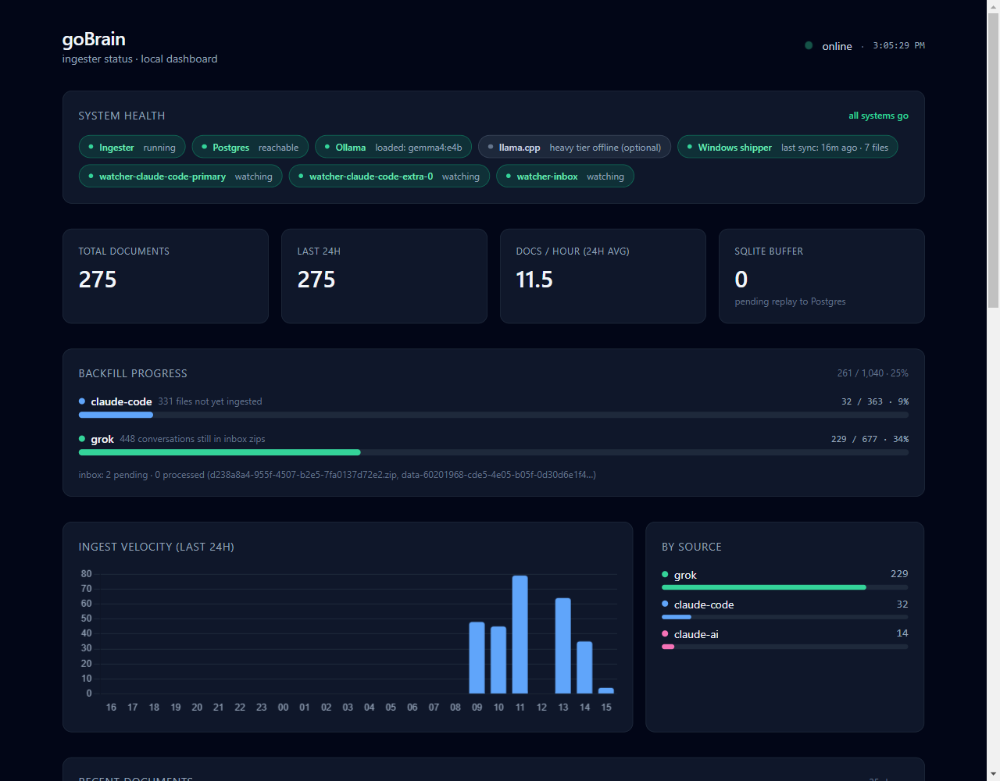
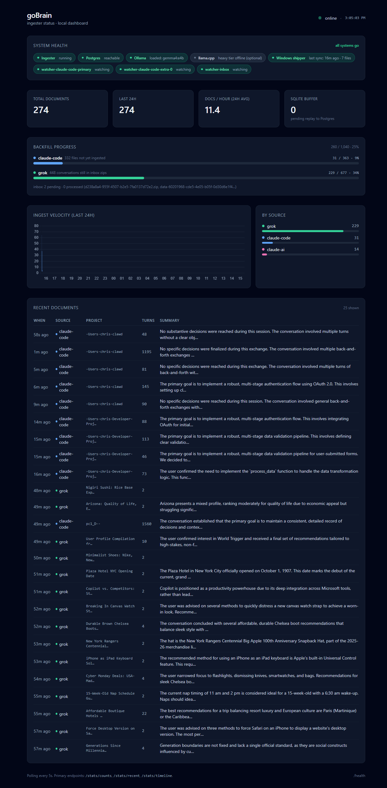

# goBrain

A self-hosted, local-first **unified second brain** that captures AI conversations and agent activity from every tool you use, indexes them with vector embeddings, and exposes a single `search_brain` tool to any client that speaks the Model Context Protocol (MCP).

Today, conversations you have with Claude (web, desktop, mobile, CLI), Grok, Claude Code terminal sessions, and any autonomous Claude Code agents you run are **siloed** — none of them can reference what happened in the others. goBrain unifies them into one markdown vault + one pgvector index, queryable from wherever you work.

<p align="center">
  
  <br>
  <em>The zero-build dashboard served by the ingester at <code>/dashboard</code>.</em>
</p>

---

## Highlights

- **Local-first.** Your data stays on hardware you own. The only model calls that leave your network are the ones you explicitly direct (e.g., asking Claude a question while it has your brain context loaded).
- **Hybrid inference.** Small always-on local LLMs (via Ollama) do the librarian work — embeddings, summaries, rerank — while a large on-demand MoE model (via `llama.cpp`) is available for heavier offline work. Cloud LLMs are opt-in, never required.
- **Everything is markdown.** The primary vault is plain markdown files, browsable in Obsidian. The vector index is an *additional* lens on top of the same content.
- **Multiple AI sources, one query.** `search_brain("...")` runs against your full conversational history regardless of which tool or device produced it.
- **Graceful degradation.** When the local GPU is busy with ingestion, search falls back to raw vector retrieval so you still get fast answers.

---

## Architecture

```
┌────────────────────────┐      ┌────────────────────────────────┐
│ Your desktop / laptop  │      │ Your always-on host (Mac Mini, │
│ ──────────────         │      │ mini PC, or similar)           │
│ Claude Code CLI        │      │ ─────────────────────────────  │
│ Claude Desktop         │      │ Claude Code CLI                │
│ Obsidian (read/write)  │      │ Obsidian (read/write)          │
│ MCP brain (stdio)      │      │ MCP brain (stdio)              │
│                        │      │                                │
│ ┌─────────────────┐    │      │ Ingester (FastAPI :8765)       │
│ │ Scheduled task  │    │      │  ├─ Claude Code watcher        │
│ │ ships CC JSONLs │──sync──►  │  ├─ Inbox watcher              │
│ │ to synced Brain │    │      │  └─ Dashboard + admin API      │
│ └─────────────────┘    │      │                                │
└────────────────────────┘      │ Ollama :11434                  │
                                │   small-LLM:embed  (embeddings)│
                                │   small-LLM:rerank (MCP search)│
                                │   small-LLM:summarize (ingest) │
                                │                                │
                                │ llama.cpp :8081 (on-demand)    │
                                │   large-MoE (heavy tier)       │
                                └──────────┬─────────────────────┘
                                           │ network
                                           ▼
┌──────────────────────────────────────────────────────────────────┐
│ NAS / server                                                     │
│ ────────────                                                     │
│ <vault-root>/Brain/                  ← vault (markdown)          │
│   ├─ sessions/<source>/              per-conversation notes      │
│   ├─ _inbox/                         drop zone for manual drops  │
│   └─ .claude-code-sources/pc/        cross-machine CC JSONLs     │
│                                                                  │
│ Docker compose:                                                  │
│   Postgres 16 + pgvector (port 5433)                             │
│   tables: documents, chunks, ingestion_log                       │
└──────────────────────────────────────────────────────────────────┘
```

The three-machine split is the reference deployment (one desktop + one always-on host + one storage host), but any subset of these can run on one box for a simpler setup.

---

## What goes in, and how

| Source | Ingestion path |
|---|---|
| **Claude Code CLI** (local to the ingester) | Live watcher on `~/.claude/projects/**/*.jsonl` — sessions are picked up automatically 5 min after they go idle |
| **Claude Code CLI on a different machine** | Scheduled task on that machine (examples provided for Windows PowerShell and Unix cron) copies finished JSONLs into a synced folder; ingester's multi-dir watcher picks them up |
| **Claude web / Claude Desktop / Claude iOS** | One export → drop the ZIP into `<vault>/_inbox/`. Parser detects it, summarizes each conversation with your local LLM, indexes everything. Subsequent monthly exports dedup to just new content. |
| **Grok** | Same pattern — export from x.ai account, drop into `_inbox/` |
| **Any structured agent** | POST events to `/ingest/document` |
| **Ad-hoc text, markdown, PDF** | Drop the file into `_inbox/` — parsed as a single document |

---

## What comes out

Three retrieval surfaces against the same index:

1. **`search_brain(query, limit, sources)`** — MCP tool. Returns top-K ~500-token chunks, each with source metadata. Gemma-E2B-class reranker scores candidates when your GPU isn't busy; falls back to pure ANN when it is.
2. **`recent_sessions(n, source)`** — MCP tool. Chronological list of the most recently ingested documents.
3. **Obsidian** — because the vault is a folder of markdown, every tool in the Obsidian ecosystem works on it. Graph view, backlinks, full-text search, plugins.

---

## Requirements

### Hardware (reference setup)

- **Always-on host:** an Apple Silicon Mac (16 GB+ unified memory recommended) or a Linux box with a GPU that can run small ~4B-parameter quantized LLMs locally. More RAM = less model-swap churn.
- **Storage host:** anything running Docker. The Postgres DB is a few hundred MB for typical corpora; the vault is similar. A NAS with Docker/Container Manager is ideal but not required.
- **Client machines:** whatever you use for daily work. Windows, macOS, or Linux.

### Software

- **Ingester + MCP server** — Python 3.11+, [`uv`](https://github.com/astral-sh/uv) for env management
- **Local LLMs** — [Ollama](https://ollama.com/) for always-on small models; optional [`llama.cpp`](https://github.com/ggerganov/llama.cpp) for on-demand heavy tier
- **Storage** — Postgres 16 + the [`pgvector`](https://github.com/pgvector/pgvector) extension, easiest via the `pgvector/pgvector:pg16` Docker image
- **Editor** — [Obsidian](https://obsidian.md/) (optional but recommended for browsing the vault)
- **Sync** — any two-way folder sync that works for you: Synology Drive, Syncthing, rsync, Dropbox, etc. goBrain is agnostic.

### Models

The reference config uses the **Gemma 3 / Gemma 4** family (E2B for rerank, E4B for summarization) and **nomic-embed-text** for embeddings — all Ollama pulls. The heavy tier uses Qwen 3.5 35B-A3B MoE via `llama.cpp`. All are swappable via config.

---

## Quickstart

> The reference deploy is three hosts. You can collapse it to one machine by pointing everything at `localhost`.

```bash
# 1. Storage host — Postgres + pgvector
cd compose/postgres
cp .env.example .env
# edit .env: set POSTGRES_PASSWORD (openssl rand -base64 32)
docker compose up -d

# 2. Always-on host — LLM stack
cd mac-mini
./setup-ollama.sh                   # pulls Gemma models + embed model, installs LaunchAgent
./setup-llamacpp.sh                 # optional: heavy tier (13 GB model download)

# 3. Always-on host — ingester
cd ../ingester
cp .env.example .env
# edit .env: vault path, Postgres DSN pointing at storage host
uv sync
cd ../mac-mini
./setup-ingester.sh                 # installs ingester as a LaunchAgent; verifies health

# 4. Each client machine — MCP server
cd ../mcp-server
cp .env.example .env
# edit: Postgres DSN, Ollama base URL (always-on host's LAN IP), local vault path
uv sync
claude mcp add brain --scope user -- uv run --directory $(pwd) brain-mcp

# 5. (Optional) Windows client — Claude Code shipper
cd ../windows
.\install-shipper.ps1               # every-10-min scheduled task that ships finished JSONLs
```

Full step-by-step including troubleshooting in [docs/runbook.md](docs/runbook.md).

---

## Common ops

**Ingest a Claude.ai or Grok export:**
```bash
mv ~/Downloads/<export>.zip <vault>/_inbox/
# Watcher picks it up. Per-conversation summaries arrive over the next minutes/hours.
```

**Observe status in a dashboard:**
```
http://<ingester-host>:8765/dashboard
```

Zero-build HTML/JS dashboard served by the ingester itself — system health (Postgres, Ollama + currently-loaded model, each watcher task, Windows shipper freshness), backfill progress per source, 24h ingest velocity, recent documents, SQLite buffer depth. Polls every 5 seconds.

<p align="center">
  
</p>

**Check ingest progress from the command line:**
```bash
curl -s http://<ingester-host>:8765/health
docker compose exec postgres psql -U brain -d brain -c \
  "SELECT source, count(*) FROM documents GROUP BY source ORDER BY count(*) DESC;"
```

**Backfill historical Claude Code sessions:**
```bash
curl -X POST http://<ingester-host>:8765/admin/reingest/claude-code
```

**Re-process everything in the inbox:**
```bash
curl -X POST http://<ingester-host>:8765/admin/reingest/inbox
```

**Search from Claude Code (after MCP registration):**
> Use search_brain to find what we decided about the auth migration.

---

## Documentation

- [docs/architecture.md](docs/architecture.md) — design rationale, data model, model routing decisions
- [docs/runbook.md](docs/runbook.md) — deploy + failure modes + recovery
- [docs/model-routing.md](docs/model-routing.md) — which local LLM does what and why

---

## Known caveats

- **Synology Drive on-demand sync is incompatible with the inbox watcher.** Files sync as 0-byte placeholders that Python can read superficially but `zipfile.ZipFile` can't open properly. Disable "on-demand sync" on the Sync Task covering the vault. Documented in [docs/runbook.md](docs/runbook.md).
- **`MAX_LOADED_MODELS=1` causes rerank contention** during bulk ingest. The MCP server detects this via Ollama's `/api/ps` and falls back to raw ANN top-K so search stays fast. Full rerank resumes automatically when nothing else is contending.
- **Claude Code's local watcher does not re-scan on startup** — it only catches modified files. Use `/admin/reingest/claude-code` to backfill historical sessions after a fresh install or a Postgres wipe.
- **Each machine running `claude-code` produces independent session files**. Cross-machine capture relies on a sync layer (Drive, Syncthing, etc.) putting all of them somewhere the ingester's multi-dir watcher can see.

---

## Contributing

goBrain is built around a specific reference setup but the components are deliberately small and swappable. Contributions that keep the local-first / markdown-first ethos are welcome. See [CONTRIBUTING.md](CONTRIBUTING.md).

Report security issues per [SECURITY.md](SECURITY.md).

---

## License

[MIT](LICENSE).
